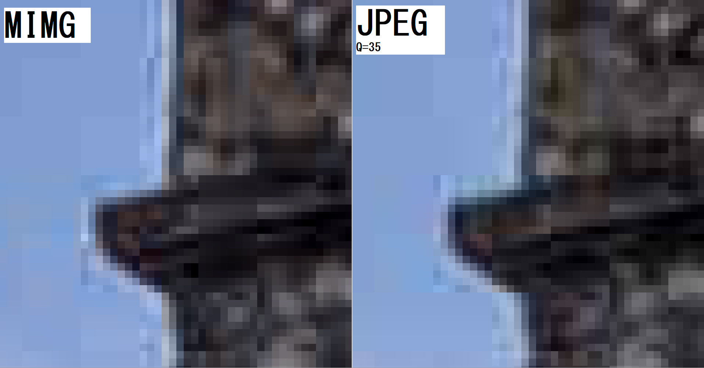

# MIMG

Experimental image compressor using parts of JPEG standard written in Python using Pillow, Numpy and cv2 libraries.
Uses the [YCoCg](https://en.wikipedia.org/wiki/YCoCg) color model, default chroma subsampling is 4:2:0 and the DCT quantization table is the same as JPEG (MIMG uses the same quantization table for luma and color channels).

## MIMG compression

This is how the algorithm performs on photos: [Test image source](https://commons.wikimedia.org/wiki/File:Morgan_House_Kalimpong_2.jpg)


The same photo compressed using MIMG


Detailed view of resulting macroblocks compared to JPEG (q=35):



## Test image statistics

Basic MIMG compression statistics:

Note: the higher the compression ratio, the better.

<table>
    <tr>
        <th>image</th>
        <th>raw (KiB)</th>
        <th>mimg (KiB)</th>
        <th>compression ratio</th>
    </tr>
    <tr>
        <td>gradient-01</td>
        <td>3 072</td>
        <td>4.5</td>
        <td>689.6</td>
    </tr>
    <tr>
        <td>gradient-02</td>
        <td>6 075</td>
        <td>1.2</td>
        <td>4894.4</td>
    </tr>
    <tr>
        <td>gradient-03</td>
        <td>6 075</td>
        <td>8.1</td>
        <td>747.2</td>
    </tr>
    <tr>
        <td>photo-01</td>
        <td>1 882</td>
        <td>46.1</td>
        <td>40.9</td>
    </tr>
    <tr>
        <td>photo-02</td>
        <td>7 178</td>
        <td>334.4</td>
        <td>21.5</td>
    </tr>
    <tr>
        <td>photo-03</td>
        <td>6 958</td>
        <td>351.3</td>
        <td>19.8</td>
    </tr>
    <tr>
        <td>photo-04</td>
        <td>114 413</td>
        <td>3 066.2</td>
        <td>37.3</td>
    </tr>
    <tr>
        <td>photo-05</td>
        <td>81 154</td>
        <td>2 293.4</td>
        <td>35.4</td>
    </tr>
    <tr>
        <td>photo-06</td>
        <td>17 625</td>
        <td>363.3</td>
        <td>48.5</td>
    </tr>
    <tr>
        <td>render-01</td>
        <td>6 075</td>
        <td>92.9</td>
        <td>65.4</td>
    </tr>
    <tr>
        <td>render-02</td>
        <td>6 075</td>
        <td>84.2</td>
        <td>72.1</td>
    </tr>
    <tr>
        <td>render-03</td>
        <td>24 300</td>
        <td>74.5</td>
        <td>326.2</td>
    </tr>
    <tr>
        <td>render-04</td>
        <td>18 432</td>
        <td>234.4</td>
        <td>78.6</td>
    </tr>
    <tr>
        <td>test-pattern-01</td>
        <td>6 075</td>
        <td>2.1</td>
        <td>2916.5</td>
    </tr>
    <tr>
        <td>test-pattern-02</td>
        <td>6 075</td>
        <td>0.9</td>
        <td>6624.9</td>
    </tr>
    <tr>
        <td>test-pattern-03</td>
        <td>6 075</td>
        <td>4.7</td>
        <td>1292.8</td>
    </tr>
    <tr>
        <td>ui-01</td>
        <td>6 075</td>
        <td>49.2</td>
        <td>123.5</td>
    </tr>
    <tr>
        <td>ui-02</td>
        <td>6 075</td>
        <td>82.3</td>
        <td>73.8</td>
    </tr>
    <tr>
        <td>ui-03</td>
        <td>2 243</td>
        <td>67.1</td>
        <td>33.4</td>
    </tr>
</table>

MIMG compression comparison vs JPEG(q=35) and PNG:

<table>
    <tr>
        <th rowspan="2" style="text-align: center">image</th>
        <th colspan="3" style="text-align: center">compression ratio</th>
        <th colspan="3" style="text-align: center">comparison</th>
    </tr>
    <tr>
        <th>MIMG</th>
        <th>JPEG</th>
        <th>PNG</th>
        <th>vs JPEG</th>
        <th>vs PNG</th>
    </tr>
    <tr>
        <td>gradient-01</td>
        <td>689.6</td>
        <td>117.4</td>
        <td>19.2</td>
        <td>+487%</td>
        <td>+3491%</td>
    </tr>
    <tr>
        <td>gradient-02</td>
        <td>4894.4</td>
        <td>132.7</td>
        <td>718.5</td>
        <td>+3589%</td>
        <td>+581%</td>
    </tr>
    <tr>
        <td>gradient-03</td>
        <td>747.2</td>
        <td>149.6</td>
        <td>103.4</td>
        <td>+399%</td>
        <td>+622%</td>
    </tr>
    <tr>
        <td>photo-01</td>
        <td>40.9</td>
        <td>46.7</td>
        <td>2.3</td>
        <td>-13%</td>
        <td>+1677%</td>
    </tr>
    <tr>
        <td>photo-02</td>
        <td>21.5</td>
        <td>24.0</td>
        <td>1.5</td>
        <td>-10%</td>
        <td>+1344%</td>
    </tr>
    <tr>
        <td>photo-03</td>
        <td>19.8</td>
        <td>21.6</td>
        <td>1.4</td>
        <td>-8%</td>
        <td>+1317%</td>
    </tr>
    <tr>
        <td>photo-04</td>
        <td>37.3</td>
        <td>41.7</td>
        <td>1.9</td>
        <td>-11%</td>
        <td>+1881%</td>
    </tr>
    <tr>
        <td>photo-05</td>
        <td>35.4</td>
        <td>52.2</td>
        <td>1.7</td>
        <td>-32%</td>
        <td>+1958%</td>
    </tr>
    <tr>
        <td>photo-06</td>
        <td>48.5</td>
        <td>52.8</td>
        <td>1.9</td>
        <td>-8%</td>
        <td>+2427%</td>
    </tr>
    <tr>
        <td>render-01</td>
        <td>65.4</td>
        <td>71.2</td>
        <td>3.4</td>
        <td>-8%</td>
        <td>+1806%</td>
    </tr>
    <tr>
        <td>render-02</td>
        <td>72.1</td>
        <td>69.0</td>
        <td>3.7</td>
        <td>+5%</td>
        <td>+1845%</td>
    </tr>
    <tr>
        <td>render-03</td>
        <td>326.2</td>
        <td>144.6</td>
        <td>4.3</td>
        <td>+126%</td>
        <td>+7436%</td>
    </tr>
    <tr>
        <td>render-04</td>
        <td>78.6</td>
        <td>70.2</td>
        <td>11.0</td>
        <td>+12%</td>
        <td>+615%</td>
    </tr>
    <tr>
        <td>test-pattern-01</td>
        <td>2916.5</td>
        <td>143.1</td>
        <td>707.5</td>
        <td>+1937%</td>
        <td>+312%</td>
    </tr>
    <tr>
        <td>test-pattern-02</td>
        <td>6624.9</td>
        <td>178.4</td>
        <td>721.9</td>
        <td>+3613%</td>
        <td>+818%</td>
    </tr>
    <tr>
        <td>test-pattern-03</td>
        <td>1292.8</td>
        <td>174.0</td>
        <td>516.5</td>
        <td>+643%</td>
        <td>+150%</td>
    </tr>
    <tr>
        <td>ui-01</td>
        <td>123.5</td>
        <td>71.0</td>
        <td>76.9</td>
        <td>+74%</td>
        <td>+61%</td>
    </tr>
    <tr>
        <td>ui-02</td>
        <td>73.8</td>
        <td>39.5</td>
        <td>39.5</td>
        <td>+87%</td>
        <td>+87%</td>
    </tr>
    <tr>
        <td>ui-03</td>
        <td>33.4</td>
        <td>29.2</td>
        <td>9.9</td>
        <td>+14%</td>
        <td>+237%</td>
    </tr>
</table>

## Usage

Basic usage:

```python
from mimg import MImg

img = MImg.from_image("image.png") ## open image using Pillow library
img.save("image.buf")              ## save (and compress) in MImg format

img = MImg.open("image.buf")       ## open (and decompress) image in MImg format
img._image.show()                  ## view the image
```
